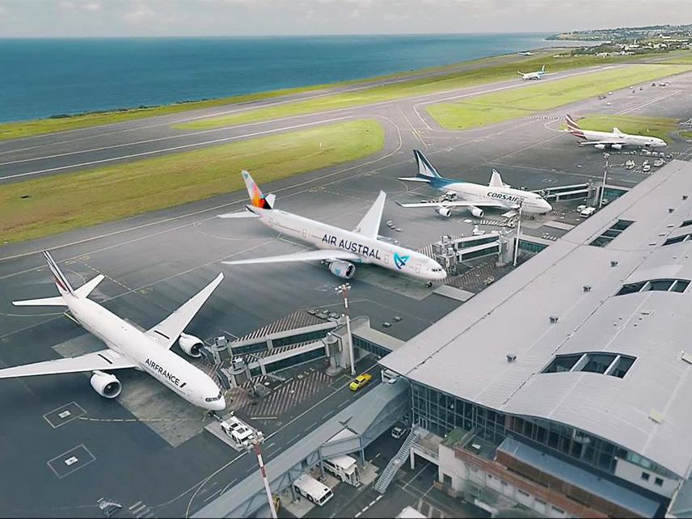
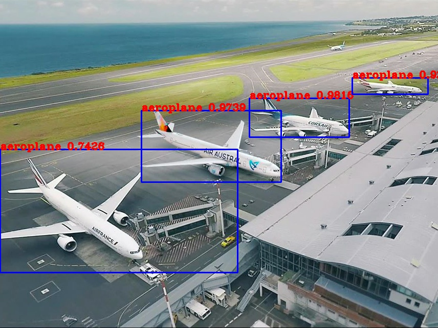
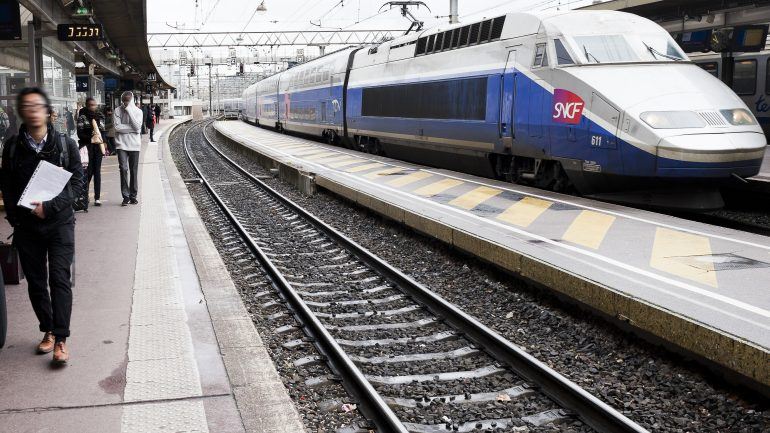
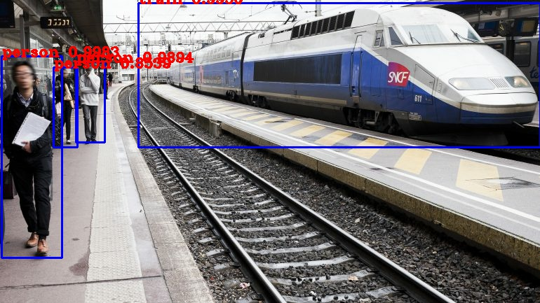

# La détection d'objet 

C'est sûrement l'exemple le plus parlant lorsque l'on parle de Machine Learning. En effet, qui n'a jamais vu une vidéo issue de cette technologie où la caméra parvient à détecter les piétons dans une allée de New York ? Si cela paraît aujourd'hui acquis avec le développement des logiciels de reconnaissance faciale, les technologies sous-jacentes ont mis beaucoup plus de temps à être mises au point comme nous avons pu le voir avec la base de données MNIST. La détection d'objet sur un flux vidéo se résume en fait à la détection d'objet sur une suite d'images extraites de ce flux vidéo. Nous verrons que trois techniques se partagent ce segment : les modèles de détection SSD, RCNN et YoloV3 où chacun a ses avantages et inconvénients.


<p align="center">
  
</p>


## YoloV3 

Ce modèle de détection est le plus innovant à ce jour et très certainement le plus performant face à ses rivaux. Il utilise une technique tout à fait singulière pour la détection si bien qu'il a bénéficié de nombreuses mises-à-jour dans les dernières années (Yolo v1 en 2015, v2 en 2016 et v3 en 2018). Je ne m'arrêterai pas sur l'architecture interne mais vous pouvez retrouver un large éventail d'explication dans le livre d'[Aurélien Géron](https://www.oreilly.com/library/view/hands-on-machine-learning/9781492032632/) et sur [Internet](https://mc.ai/the-beginners-guide-to-implementing-yolo-v3-in-tensorflow-2-0-part-1/). Il n'existe pas à l'heure actuelle d'implémentation de Yolov3 officiellement reconnue par Google donc j'utiliserai celle de [Zihao Zang](https://github.com/zzh8829/yolov3-tf2). 

Pour la suite je supposerai que vous avez suivi le [tutoriel](https://github.com/IAFutur/MachineLearning/blob/master/InstallTensorflow.md) et que votre machine est dans la configuration résultante. Pensez aussi à garder vos pilotes graphiques à jour pour éviter les problèmes de compatibilité. Commencez par télécharger le dossier entier sous forme .zip avec le bouton `` Clone or download`` et décompressez-le. 

Maintenant il vous faut vérifier que vous avez installé les bibliothèques utilisées par Yolov3. La liste se trouve dans ``requirements.txt``ou ``requirements-gpu.txt`` selon que vous utilisez un PC avec ou sans GPU pour le Machine Learning. Ouvrez Anaconda Prompt et activez votre environnement virtuel ``votreVenv`` avec la commande :

```bash 
activate votreVenv
```

Puis vous pouvez installer les packages qu'il vous manque dans votre environnement virtuel. De cette façon pas besoin de démarrer Anaconda Navigator. 

``` bash 
conda install tensorflow-gpu opencv-python lxml tqdm
```

Le modèle est vide de contenu, c'est-à-dire que vous avez téléchargé l'architecture et les fichiers de configurations mais rien pour les remplir. Vous devez maintenant télécharger les poids (weights en anglais) pour pouvoir utiliser votre modèle et effectuer la détection d'objet. Ces poids viennent d'un modèle qui a déjà était entrainé et que vous pouvez téléchargez avec le [lien](https://pjreddie.com/media/files/yolov3.weights) pour les poids classiques de Darknet ou avec ce [lien](https://pjreddie.com/media/files/yolov3-tiny.weights) les poids simplifiés (tiny weights) qui permettent une détection plus rapide mais avec un éventail d'objets à détecter plus restreint. Ensuite il vous faut transformer ces poids en modèle qui va être stocké en mémoire et utilisé lors de l'exécution de l'algorithme. 

```bash
cd $path du dossier yolov3-tf2-master$

# pour les poids classiques 
python convert.py

# pour les poids simplifiés 
python convert.py --weights ./data/yolov3-tiny.weights --output ./checkpoints/yolov3-tiny.tf --tiny
```

Finalement vous pouvez procéder à la détection avec les commandes que vous retrouvez dans le GitHub source : 

```bash
# yolov3
python detect.py --image ./data/meme.jpg

# yolov3-tiny
python detect.py --weights ./checkpoints/yolov3-tiny.tf --tiny --image ./data/street.jpg

# webcam
python detect_video.py --video 0

# fichier video 
python detect_video.py --video path_to_file.mp4 --weights ./checkpoints/yolov3-tiny.tf --tiny

# fichier vidéo avec sortie 
python detect_video.py --video path_to_file.mp4 --output ./output.avi
```


On peut remarquer que le modèle utilise des programmes différents pour gérer la détection sur images ou sur flux vidéo : c'est bien normal car le programme utilise la bibliothèque OpenCV qui gère l'extraction des images. On retrouve bien la syntaxe de OpenCV avec le 0 pour la vidéo : 1 ou 2 vous permettra de choisir la webcam à utiliser pour le flux d'entrée et remplacer ce chiffre par un path jusqu'à une vidéo vous permettra d'effectuer la détection d'objet sur un fichier vidéo enregistré sur votre disque. Si vous souhaitez utiliser les poids classiques ou simplifiés c'est sur cette ligne que s'effectue la différenciation. De plus vous pouvez aussi gérer le dossier de sortie où vous souhaitez stocker le résultat de la détection. 


| Image Originelle | Image après YoloV3 |
|:-------------------------:|:-------------------------:|
|  |  |
|  |  |

Voilà ! Vous savez maintenant comment implémenter une détection d'objet sur différentes sources graphiques. Mais ce modèle ne se résume pas à détecter des piétons (ce qu'il fait très bien ceci dit) et nous verrons par la suite que si vous l'entrainez avec un set de données adapté il est capable de vous détecter tout ce que vous voulez avec une précision impressionnante et une latence quasi-inexistante. Restez connecté pour plus de contenu, Ciao ! 
